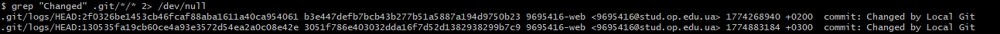
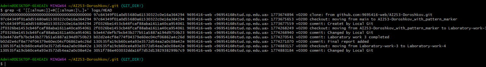
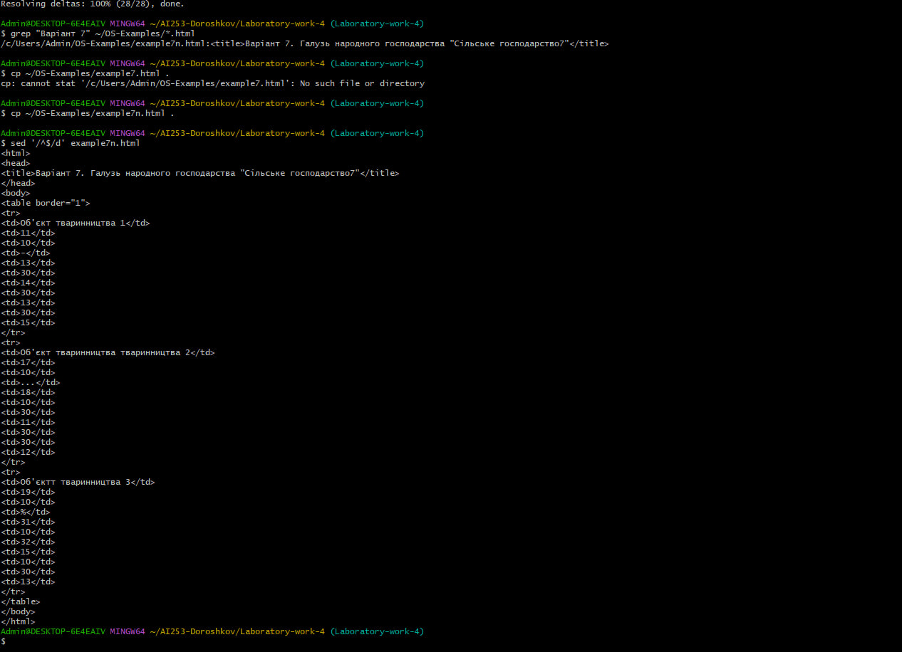
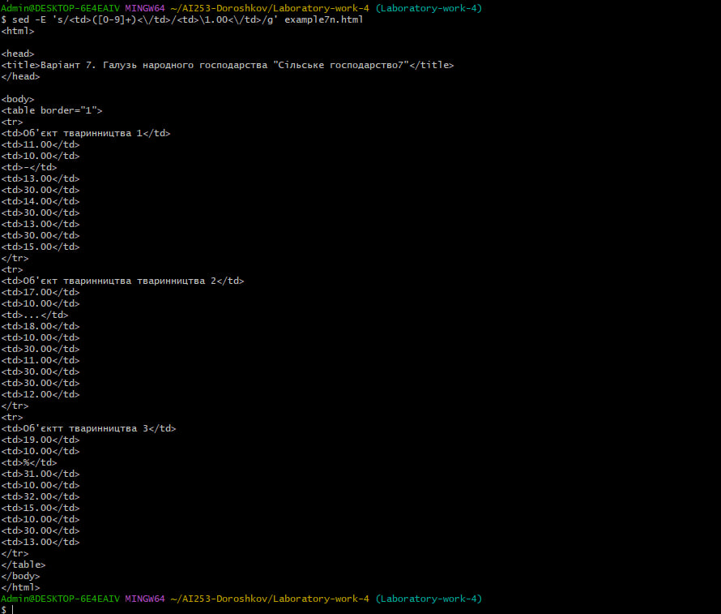
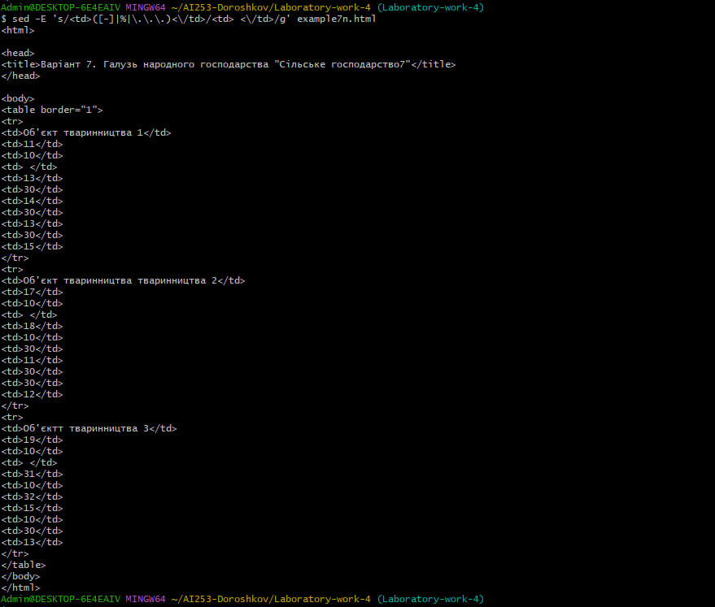
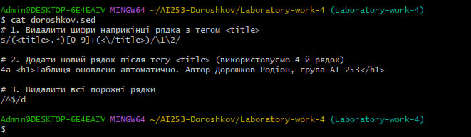
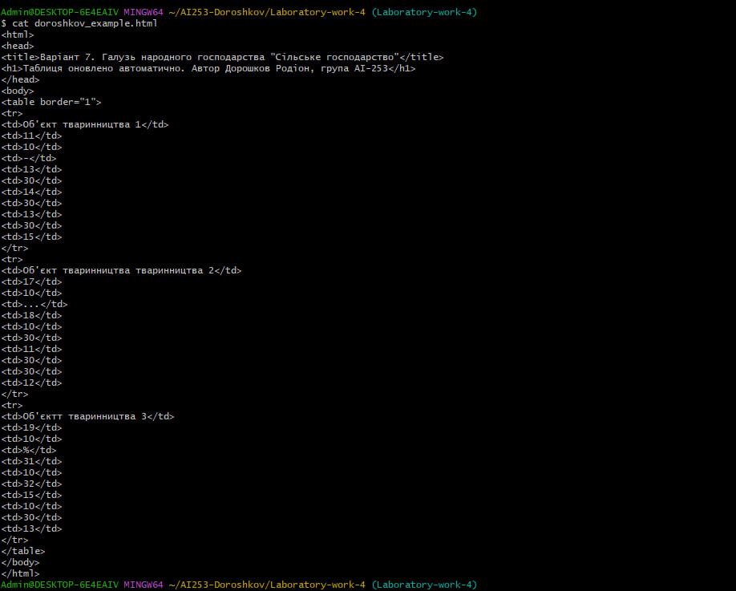

## Лабораторна робота №4
### Тема: «Складна обробка текстових даних засобами оболонки Unix-подібних ОС»

**Мета роботи:** придбання навичок складної обробки текстових даних засобами оболонки Unix-подібних ОС на прикладі утиліт підтримки програмних шаблонів регулярних виразів.

---

### 1 Пошук у системних файлах Git-репозиторію

**2.1.1** Виведення на екран рядка з коментарем для команди commit, який починається зі слова «Changed», з перенаправленням потоку помилок у `/dev/null`:

**2.1.2** Виведення на екран рядка з електронною поштовою скринькою за допомогою розширеного регулярного виразу:

---

### 2 Складний пошук та заміна текстових даних

**2.2.1** Пошук HTML-файлів за номером варіанту (Варіант 7) у репозиторії з прикладами:

**2.2.4** Виведення вмісту знайденого файлу `example7n.html` без порожніх рядків за допомогою утиліти `sed`:

**2.2.5** Перетворення цілих чисел у ячейках таблиці у числа з плаваючою комою (додавання `.00`):

**2.2.6** Заміна символів-роздільників на прогалини за допомогою регулярних виразів:

---

### 3 Автоматизована модифікація файлів з текстовими даними

**2.3.4** Пакетна модифікація файлу за допомогою сценарію `doroshkov.sed`. Сценарій видаляє цифри з тегу `<title>`, додає заголовок `<h1>` з даними автора та видаляє порожні рядки.

**Вміст файлу сценарію doroshkov.sed:**

**Результат виконання автоматизованої модифікації (файл doroshkov_example.html):**

---
